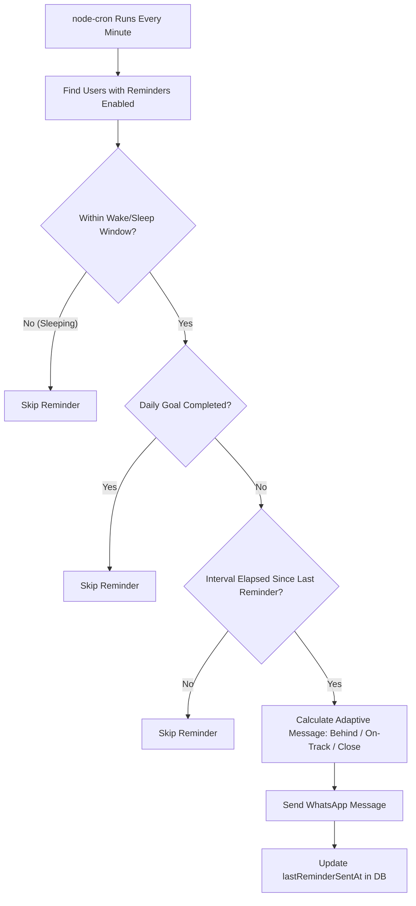

# 💧 Personal WhatsApp Water Reminder Bot

A lightweight, reliable, and intelligent personal WhatsApp Water Reminder Bot built with **Node.js, Express, MongoDB, and Mongoose**. It automatically tracks your daily hydration, sends adaptive reminders based on your wake-up and sleep schedule, visually graphs your daily progress, and stops reminders as soon as you complete your daily goal.

---

## 🌟 Features

* **Interactive WhatsApp Setup**: Easily set your daily water goal (e.g. `2500 ml`), wake-up time (e.g. `8:00 AM`), sleep time (e.g. `11:00 PM`), and reminder interval (e.g. `2 hours`) right from WhatsApp.
* **Effortless Water Tracking**: Just message a number like `250` or `500` to log water intake.
* **Dynamic Progress Bar**: Beautiful text-based progress bars (e.g., `████████░░░░░░░░ 50%`) generated on demand.
* **Adaptive Reminder Engine**:
  * **Behind Goal**: *"💧 You're a little behind today's goal. You've had 250 / 2500 ml. Try drinking some water now."*
  * **On Track**: *"💧 Time for some water! You've had 1250 / 2500 ml today."*
  * **Almost There**: *"💧 You're almost there! 2000 / 2500 ml. Only 500 ml remaining."*
* **Smart Sleep & Goal Protection**:
  * No reminders sent during sleep hours.
  * No reminders sent after you achieve your goal for the day.
  * Duplicate reminder protection (`lastReminderSentAt`).
* **Daily Reset**: Date-aware daily calendar logging (`YYYY-MM-DD` in your local timezone) while preserving complete historical records in MongoDB.
* **Dual WhatsApp Support**: Works with self-hosted gateways (**OpenWA**) as well as official **Meta WhatsApp Cloud API**.

---

## 📁 Project Structure

```text
water-reminder-bot/
│
├── src/
│   ├── config/
│   │   └── db.js                 # Resilient MongoDB Mongoose connection
│   ├── controllers/
│   │   ├── healthController.js   # GET /health endpoint
│   │   └── webhookController.js  # GET/POST /webhook handlers
│   ├── models/
│   │   ├── User.js               # User profile, goal & schedule schema
│   │   └── WaterLog.js           # Daily water log & entry history schema
│   ├── routes/
│   │   ├── healthRoutes.js       # Health routes
│   │   └── webhookRoutes.js      # Webhook routes
│   ├── services/
│   │   ├── whatsappService.js    # WhatsApp message sender (OpenWA / Meta)
│   │   ├── waterService.js       # Water intake & progress calculation
│   │   ├── userService.js        # Multi-step setup state machine & commands
│   │   └── reminderService.js    # Adaptive reminder evaluation engine
│   ├── jobs/
│   │   └── reminderJob.js        # Background cron scheduler (every minute)
│   ├── utils/
│   │   ├── timeUtils.js          # Flexible time parsing & wake window checks
│   │   ├── progressUtils.js      # Visual progress bar & response formatting
│   │   └── logger.js             # Structured timestamped logger
│   ├── app.js                    # Express app configuration & middleware
│   └── server.js                 # Server entrypoint & lifecycle management
│
├── .env                          # Local environment variables (not committed)
├── .env.example                  # Environment template
├── .gitignore
├── package.json
└── README.md
```

---

## ⚙️ Environment Variables

Create a `.env` file in the root directory:

```env
# Server Configuration
PORT=5000
NODE_ENV=development

# Database Configuration
MONGODB_URI=mongodb+srv://<username>:<password>@cluster0.mongodb.net/water-reminder-bot?retryWrites=true&w=majority

# WhatsApp Provider: "openwa" (Recommended for personal use) or "meta"
WHATSAPP_PROVIDER=openwa

# OpenWA Gateway Settings (If using OpenWA)
OPENWA_API_URL=http://localhost:2785
OPENWA_API_KEY=
OPENWA_SESSION_ID=default

# Meta WhatsApp Cloud API Credentials (If using Meta)
WHATSAPP_ACCESS_TOKEN=your_meta_access_token_here
WHATSAPP_PHONE_NUMBER_ID=your_phone_number_id_here
WHATSAPP_VERIFY_TOKEN=water_reminder_secret_verify_token_2026

# Timezone (Default: Asia/Kolkata)
TIMEZONE=Asia/Kolkata
```

---

## 🚀 Getting Started

### 1. Install Dependencies
```bash
npm install
```

### 2. Start the Development Server
```bash
npm run dev
```

### 3. Verify Health Check
Visit `http://localhost:5000/health` or run:
```bash
curl http://localhost:5000/health
```

Expected output:
```json
{
  "success": true,
  "message": "Water Reminder Bot is running",
  "database": "connected",
  "environment": "development"
}
```

---

## 💬 Supported WhatsApp Commands

| Command | Description | Example Response |
| :--- | :--- | :--- |
| `setup` | Start/restart interactive setup flow | Asks for daily goal, wake time, sleep time, interval |
| `<number>` (e.g. `250`) | Log water consumed in ml | `💧 Added 250 ml! Today's progress: 250 / 2500 ml` |
| `progress` | View current daily progress & bar | `💧 Today's Progress... ████████░░░░░░░░ 50%` |
| `status` | View schedule and current progress | Shows reminders status, active window, and progress |
| `goal` | Show current daily target | `🎯 Your current daily water goal is 2500 ml.` |
| `stop` | Pause water reminders | `⏸️ Water reminders have been paused.` |
| `start` | Resume water reminders | `▶️ Water reminders are now active!` |
| `reset` | Reset today's water intake | Asks for confirmation (`YES`) before resetting |
| `help` | Show available commands | Displays command guide |

---

## 📱 Example Conversation Flow

```text
User: setup
Bot:  💧 What is your daily water goal?
      Example: 2500 ml

User: 2500
Bot:  What time do you usually wake up?
      Example: 8:00 AM

User: 8:00 AM
Bot:  What time do you usually sleep?
      Example: 11:00 PM

User: 11:00 PM
Bot:  How often should I remind you?
      Example:
      1 = Every 1 hour
      2 = Every 2 hours
      3 = Every 3 hours

User: 2
Bot:  ✅ You're all set!
      
      Daily goal: 2500 ml
      Wake up: 8:00 AM
      Sleep: 11:00 PM
      Reminder: Every 2 hours
      
      I'll remind you to drink water 💧

User: 500
Bot:  💧 Added 500 ml!
      
      Today's progress:
      
      500 / 2500 ml
      20%
      
      Remaining: 2000 ml

User: progress
Bot:  💧 Today's Progress
      
      Goal: 2500 ml
      Consumed: 500 ml
      Remaining: 2000 ml
      
      Progress: 20%
      
      ███░░░░░░░░░░░░░
```

---

## ⏰ How the Reminder Engine Works



---

## 🧪 Testing the Project

Run the included end-to-end automated test suites:

* **Setup & Water Tracking Flow**:
  ```bash
  node test-flow.js
  ```
* **Adaptive Reminder & Scheduler Engine**:
  ```bash
  node test-reminder.js
  ```
